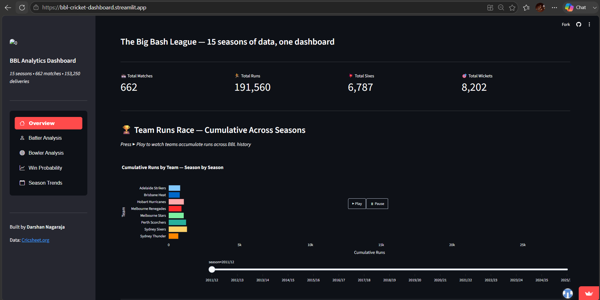

#  BBL Cricket Analytics Dashboard

An end-to-end data science project analysing 15 seasons of Big Bash League (BBL) cricket from raw ball-by-ball data to a deployed, interactive dashboard with a machine learning win probability model.

**🔗 Live Dashboard:** [bbl-cricket-dashboard.streamlit.app](https://bbl-cricket-dashboard.streamlit.app/)



---

##  Overview

This project covers the full data science lifecycle:
- **Data engineering** — cleaning and merging 153,250 ball-by-ball deliveries across 662 matches
- **Exploratory analysis** — uncovering scoring patterns, player performance and historical trends
- **Machine learning** — a Gradient Boosting model predicting live win probability with 82% accuracy
- **Deployment** — a fully interactive Streamlit dashboard, live on the web

---

##  Key Insights

-  **CA Lynn** is BBL's all-time top run scorer (4,088 runs), while **SA Abbott** leads all-time wickets (196)
-  **GJ Maxwell** has the best strike rate (155.9) among elite batters
-  **JP Behrendorff** is the most economical elite bowler (6.93 economy)
-  Winning the toss barely matters in BBL only a 53% win rate. But **fielding first wins 54.6%** of matches vs 50.4% for batting first
-  BBL has gotten significantly more explosive — **2025/26 set an all-time record for sixes per match (12.5)**, up ~45% from the league's first season

---

##  Win Probability Model

A Gradient Boosting Classifier trained on 153,250 deliveries from 662 BBL matches, predicting the chasing team's win probability ball-by-ball.

| Metric | Score |
|---|---|
| Accuracy | **82.0%** |
| AUC Score | **0.902** |

**Top predictive features:**
1. Required run rate (50.3% importance)
2. Run rate pressure (18.4%)
3. Target score (14.5%)

> The model learned that *pressure*, not raw time remaining, is what actually determines chase outcomes in T20 cricket.

---

##  Dashboard Features

| Page | What it shows |
|---|---|
| **Overview** | Animated team run race, scoring heatmap by over, toss analysis |
| **Batter Analysis** | Top scorers, head-to-head radar comparison, individual player profiles |
| **Bowler Analysis** | Top wicket takers, phase-specific economy heatmap, bowling radar |
| **Win Probability** | Ball-by-ball animated win probability with play/pause controls |
| **Season Trends** | 15-season evolution of scoring, sixes and match volume |

---

##  Tech Stack

- **Data processing:** Python, Pandas, NumPy
- **Machine learning:** Scikit-learn (Gradient Boosting Classifier)
- **Visualisation:** Plotly
- **Dashboard:** Streamlit + streamlit-option-menu
- **Data source:** [Cricsheet.org](https://cricsheet.org) (ball-by-ball BBL data)
- **Deployment:** Streamlit Community Cloud

---

##  Project Structure

bbl-cricket-dashboard/

│

├── data/

│   ├── raw/                  # Original Cricsheet CSV files

│   └── processed/            # Cleaned parquet files

│

├── docs/

│   ├── dashboard_preview.png/

|

├── notebooks/

│   ├── 01_data_cleaning.ipynb

│   ├── 02_data_cleaning.ipynb

│   ├── 03_eda.ipynb

│   └── 04_model.ipynb

│

├── app/

│   ├── streamlit_app.py      # Main dashboard

│   └── model.pkl             # Trained ML model

│

├── requirements.txt

└── README.md
---

##  Running Locally

```bash
# Clone the repo
git clone https://github.com/darshann305/bbl-cricket-dashboard.git
cd bbl-cricket-dashboard

# Install dependencies
pip install -r requirements.txt

# Run the dashboard
streamlit run app/streamlit_app.py
```


##  Author

**Darshan Nagaraja**
[LinkedIn](https://www.linkedin.com/in/darshan-nagaraja-024862409/) • [GitHub](https://github.com/darshann305)

---

## Data License

Data sourced from [Cricsheet.org](https://cricsheet.org), used under their open data license for non-commercial analysis.